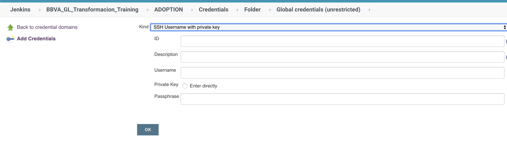

# Jenkins requirements

## Plug-ins

1. Go to: Manage Jenkins > Manage Plugins

> [Managing Jenkins's plugins (official documentation)](https://jenkins.io/doc/book/managing/plugins/)

2. Ensure your master has the following plugins installed, with the recommended version

| Name | Recommended version | Description | Mandatory |
| ---  | ---- | --- | --- |
| AnsiColor | any | very useful for colourful output | yes |
| Artifactory | 2.x | Allows [easy interaction with an Artifactory server](https://www.jfrog.com/confluence/display/JFROG/Jenkins+Artifactory+Plug-in) | not really, but recommended |
| Pipeline Utility Steps | latest | Collection of [useful utilities](https://github.com/jenkinsci/pipeline-utility-steps-plugin/blob/master/docs/STEPS.md) | yes |
| Timestamper | any | Different options for timestamp display in jobs | recommended |
| Workspace Cleanup | any | allows using cleanWs() to cleanup workspaces in an efficient way | recommended |
| Samuel | latest | Allows calling Samuel directly without declaring libraries | yes |
| Pipeline: Groovy | 2.80+ | This version fixes a bug found in withCredentials blocks | yes |

## Artifactory plugin configuration

**NOTE: Although Artifactory Plugin v3.0 is available, it is not fully compatible yet with one of our libraries. Use it at your own risk**

In order to properly set up the Artifactory plugin, you need to fill the server URL, and associate an ID with it.
This ID will be used as part of the configuration later

> "Manage Jenkins" > "Configuration"

| Tools | ID | Url |
|-------------|----|----|
|Artifactory|globaldevtools|https://globaldevtools.bbva.com/artifactory-api |


## Global tool configuration

Global tools are used to tell Jenkins where to find certain executables by ID.

In our case, this is used in the maven sections, specifically those using a custom image with several versions of the JDK or Maven installed.

If you use a custom agent/image, chances are you **do not need** to configure any tool.

### How to register a global tool

1. Go to: Manage Jenkins > Global Tool Configuration
2. Navigate to the appropriate section.
3. Register as many MVN and JDK as necessary. These IDs are the ones that apply to the `maven` and `java` values within UUAA's Jenkinsfile.


Note the warnings: the binaries paths do not need to exist in the Jenkins master, but in the agent they are going to be run from.

**Repeat**

They need to exist just in the agent they are going to be running from.

## How to use a global tool

One possible configuration for a maven step would look like this:

```yaml
    steps:
      - label: 'Build with maven'
        use: 'maven'
        with_params:
          maven_settings: 'file: settings_spring'
          goal: 'clean install versions:set -DnewVersion={{ repo.version }}'
          mavenTool: 'maven3'
          javaTool: 'JDK8'
          with_cachelo:
            key: '{{ uuaa }}-maven-cache'
            paths: ["{{ env.WORKSPACE }}/.m2"]
```


## Register shared libraries available

You must register the available shared libraries in order to be able to include them into your pipelines.

> [Extending with Shared Libraries; official documentation](https://jenkins.io/doc/book/pipeline/shared-libraries/)


| name | SSH URL | recommended ID | recommended branch/tag | Mandatory |
|:------|:-------|:---------------|:-----------------------|:----------|
| Standard pipeline | ssh://git@globaldevtools.bbva.com:7999/gpipe/jenkins-workflow.git | std-pipeline | tags/4.0 | yes |
| Platform's shared library | ssh://git@globaldevtools.bbva.com:7999/bgdts/workflowlibs.git | workflowlibs | 1.23 | yes |
| SonarQube shared library |ssh://git@globaldevtools.bbva.com:7999/bgt/sonar-workflowlibs.git | sonar | lts | no |
| Chimera |  ssh://git@globaldevtools.bbva.com:7999/khwkx/khwkx_chimera_jenkins_sdk.git | chimera | master | no |
| Test Legacy Worflowlib | ssh://git@globaldevtools.bbva.com:7999/bgt/test-legacy-workflowlib.git | libRunTests | develop | no |
| Cachelo | ssh://git@globaldevtools.bbva.com:7999/bgp/cachelo.git | cachelo | 1.3.0 | no |


## Credentials

There are two main locations for Jenkins credentials to be aware of:

1. Global credentials: https://globaldevtools.bbva.com/<your_jenkins_master>/credentials/
2. Folder credentials, which is basically the same, but with a lower scope as it is defined per-job/folder:
credentials are always resolved from here upwards:  https://globaldevtools.bbva.com/<your_jenkins_master>/job/<your_folder>/credentials/store/folder/


## How does STD Pipeline use credentials

They are used to access GIT, Artifactory and Bitbucket on your behalf. As any other Jenkins credential, they are accessed via their ID:


Those IDs are later used directly in different sections of the configuration files:

```yml
modules:
  git:
    credentialsId: spring_co_orquidea_rsa_token

  bitbucket:
    credentialsId: spring_co_orquidea_bitbucket_token
    credential_type: userpass


  artifactory:
    credentialsId: spring_co_orquidea_artifactory_token
    credential_type: userpass

stages:
  build:
    steps:
      - label: 'Build with maven'
        use: 'maven'
        with_params:
          maven_settings: 'file: settings_spring'
          goal: 'clean install versions:set -DnewVersion={{ repo.version }}'
```

## Mandatory credentials

As of today (release 4.2) four credentials needs to be reachable from the running jobs.

> The recommended way of creating credentials is using **impersonal access** _via_ bots, for that you will need to ask a set of credentials via [Service Desk](https://globaldevtools.bbva.com/jira/servicedesk/customer/portal/26/create/333), level 'General Standard Pipeline'. In there, describe what resources you will  need to access to.

Below, we will describe the process to get access via your personal user. This is **not recommended**, but very useful for understanding what is needed, or just for testing purposes.

### Git SSH key

Used for authenticated access to the repository in the build phase.

If you do not have a valid SSH credential yet:

1. Create your own SSH keypair, locally, with the `ssh-keygen` command
2. Go to Bitbucket, [SSH keys](https://globaldevtools.bbva.com/bitbucket/plugins/servlet/ssh/account/keys), and upload your **PUBLIC** key.
3. Go to the credentials section, and create a new credential, type 'SSH username with private key':



4. For the values, choose the ID you like, and fill in the description as you see fit. Also upload here your **PRIVATE** key and passphrase if applicable, and finally type in 'git' as the user name


### Bitbucket Token

The Bitbucket token is used to access the Pull Request API, from where we read information on PR status.

1. Create a new [Bitbucket token](https://globaldevtools.bbva.com/bitbucket/plugins/servlet/access-tokens/manage) with Write/Write access, write down that value!!
2. Create a new username/password credential, use your Bitbucket username (email without the domain) and the value of the token from the step above.

### Artifactory API Key

In order to push to Artifactory, we will need an User with deployment permissions.

> NOTE: If you use maven with a settings file, the Artifactory credentials will be read from there instead. Still, these are **mandatory**.

1. Go to your [Artifactory Settings page](https://globaldevtools.bbva.com/artifactory/webapp/#/profile) and get/create your API Key.
2. Create a new username/password credential, use your Artifactory username (email without the domain) and the value of that API Key.

This token will only have access to those repositories you have access to. In a real case, when you request an Artifactory bot via Service Desk, you will need to specify the paths where you will upload your artifacts to!!

### Chimera credentials

Starting with release 4.2, Samuel will automatically call Chimera to perform a non-blocking analysis.
To allow this analysis, **as of the time of this release**, you need to contact Chimera team [via Service Desk](https://globaldevtools.bbva.com/jira/servicedesk/customer/portal/26/group/93?q=chimera), opening a ticket to 'Core Security - Request'.

> This process only needs to be done ONCE PER MASTER.

## Optional credentials

### Maven settings file (settings.xml)

Check [setting the Artifactory repository](https://www.jfrog.com/confluence/display/RTF/Maven+Repository).

These files also need an username and api key value, which is the same as the one described above. You can create the file yourself, and upload it as a **Secret file** type of credential, or ask through Service Desk for it.


## Docker agent-template
These templates will be used during the build, test and deploy stages. The same image can be used for the 3 stages, if specific needs are satisfied in each stage (ie. JDK+maven,Dimensions client, etc).

Phases prior to construction (obtaining a version, for example) use [**generic**](https://globaldevtools.bbva.com:5000/piaas/generic:latest), the most basic image available in globaldevtools.

> The image must be installed as an agent template in each Jenkins master following the [instructions in the Platform documentation](https://platform.bbva.com/en-us/developers/dev-tools/devops-clan/documentation/build-deploy/build-deploy-devops-guides/jenkins-enterprise/slaves/create-custom-slaves).


### Recommended images for Java
[Java+MVN image](https://globaldevtools.bbva.com:5000/piaas/piaas-es-producto-negocio/docker-ldbad103:1.7) with the following packages:
  - JDK6
  - JDK7
  - JDK8
  - MVN 2.2.1
  - MVN 3.0.4
  - MVN 3.3.9

It is recommended to use this image as a base for build, adding the following configuration arguments to JVM:

```
-Xms256m -XX:+UseConcMarkSweepGC -Djava.net.preferIPv4Stack=true
```

