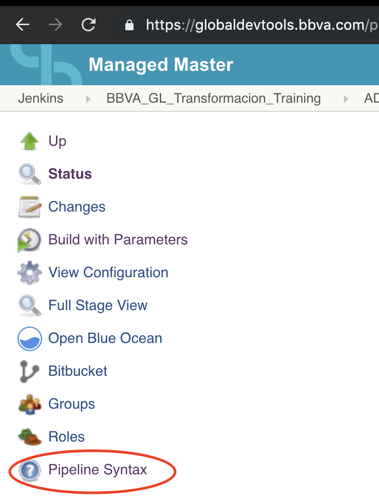

# Replace variables

In order to support custom configurations, we've enabled a Jinja-inspired syntax that enables substitution of values in the yml files.

> By no means it's Jinja, and will never be. Don't try to get fancy.

We've added the ability to replace basicallly every [Settings](../src/globals/Settings.groovy) variable, plus some other options.

## Artifact info

Information populated from the _store_ configuration section.

* `{{ artifact.version }}` - Version of the artifact that will be created
* `{{ artifact.isUpload }}`
* `{{ artifact.server }}`
* `{{ artifact.suffix }}`
* `{{ artifact.context }}`
* `{{ artifact.virtual }}`
* `{{ artifact.urlUpload }}`
* `{{ artifact.urlDownload }}`
* `{{ artifact.registry }}` - Docker Registry

While these are also valid, they should be **deprecated** soon, for clarity

* `{{ release.filePath}}` (hard-wired to `Settings.artifact.file.path`)
* `{{ release.fileName}}` (hard-wired to `Settings.artifact.file.name`)
* `{{ release.urlUpload}}` (hard-wired to `Settings.artifact.getUploadUrl()`)

## Build info (DEPRECATED)

Any of the parameters of the Build stage can be used.
As we are moving away from hard-coded stages, **this should not be relied upon.**

## Environment variables

Any of the available Environment variables found when the job starts will be available.

Examples include `{{ env.BUILD_NUMBER }}`, `{{ env.WORKSPACE }}`, and so on.



Make sure to review the `Pipeline Syntax > Global Variables` link under your Job, there is a section there with the full reference of all the available variables in your environment (among many other things).

## Repo info

Information that comes from the GIT repository we are in, and the current job we are executing.
Useful examples:

* `{{ repo.branch }}`
* `{{ repo.project }}`
* `{{ repo.slug }}`
* `{{ repo.subject }}` - current commit's message
* `{{ repo.author_name }}`
* `{{ repo.author_email }}`
* `{{ repo.mergedFrom }}`
* `{{ repo.pullrequest.is }} `- Boolean flag
* `{{ repo.pullrequest.comesFrom }} `- Source branch of the PR
* `{{ repo.pullrequest.goesTo }} `- Target branch of the PR
* `{{ repo.hasSemVer }}` - Flag that is true if SemVer applies to this branch and repo
* `{{ repo.version }}` - If *hasSemVer=true*, this is the semantic tag that will be pushed

## Custom variables

These come from the app's *Jenkinsfile*.

Everything found inside a 'vars' map will be accessible here (see example below).

## Form variables

If the Pipeline has Form parameters of any kind, they will be available using the `{{ form.PARAM_ID }}` syntax.
These parameters may come from configuration or from the Jenkinsfile.

They are very useful so we can modify the flow of our build post-run, such as only running tests when the branch runs automatically.

## Example

An example will illustrate this better.

Given the following **Jenkinsfile**:

```
globalPipeline {
  country = 'es'
  group = 'escenia'
  uuaa = 'QWYZ'
  vars = [
    build_parameter: 'a new param'
  ]
}

```

And the following *configs_es/escenia.yml* configuration:

```
verbosity: 2

form:
  - type: boolean
    default: true
    id: should_run_build

  - id: maven_build_command
    when_branch:
      - develop
      - master
    type: string
    default: 'clean install versions:set -DnewVersion={{ artifact.version }}'
    default_when_false: 'clean install versions:set -DnewVersion=SNAPSHOT'
    description: |
      Maven Build command

modules:
  bitbucket:
    credentialsId: "spring_{{ country }}_{{ group }}_bitbucket_token"

stages:
  build:
    node_label: 'co-openjdk-mvn-sonarscanner'
    when: "{{ form.should_run_build }}"
    steps:
      - use: 'maven'
        with_params:
          maven_settings: 'file: settings_spring'
          goal: "{{ form.maven_build_command }}"
          with_cachelo:
            key: '{{ uuaa }}-maven-cache'
            paths: ["{{ env.WORKSPACE }}/.m2"]
```

And the we are in the `develop` branch,

Then, the following will happen:

* The BitBucket credentials will be named *spring_es_escenia_bitbucket_token*
* The build phase will depend on the input flag *should_run_build*, which will default to `true` in the fist, automatic run.
* The maven goal for building will be (something like) `mvn clean install versions:set -DnewVersion=SNAPSHOT-1234578 -DextraParam='a new param'`
* The Cachelo key used for cache retrieval will be `QWYZ-maven-cache` and will cache the entire .m2 folder in the Jenkins Workspace.
