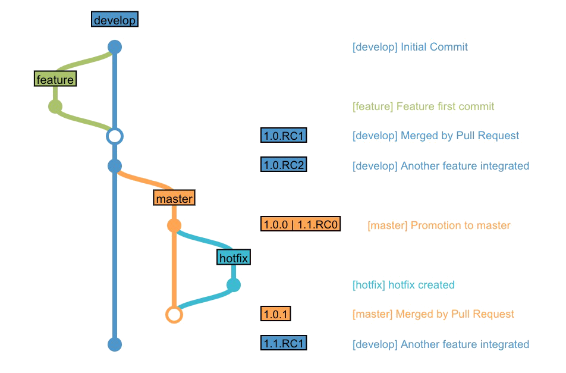

# Semantic Versioning

This pipeline uses [Git Flow Semantic Versioning][gitflow_link] for a better explanation of git flow versioning) in order to give an agnostic technology solution.
But it also supports a variation for non-release-branch application.

The following image shows a **Spring application** life cycle without release branch:


In this scenario, release branches off from develop branch, creating X.Y.RCN tag in release branch.

Our Semantic Versioning tries to get the current and next version number for the target artifact, given the current tag map from the repository. 

## How to select branching model to use

Use the top-level parameter `branching_model` in your configuration files.

```
---
verbosity: 1
environment: {}
branching_model: ''  # either 'release', 'norelease', 'none' or 'auto'. Defaults to 'auto' if empty
```

## How does semver tag

In "auto" model (enabled by default) semver will look after develop, release and master branches. If no release branch is found, "auto" mode changes to "norelease". If any release is found (release*), "auto" mode changes to "release" mode.

> Note #1: in a strict git flow, **ALL** the changes to develop/release/master come from a Pull Request, so the semver library expects that behaviour.

> Note #2: Remember that branches **ARE NOT** tagged. Commits are.

### norelease

In a "norelease" model, tags will be applied to develop with the pattern "X.Y.RCN" and master with the pattern "X.Y.Z". For example:

```
    feature     develop	        master
    |           |               | 1.0.0 ....
    * --------> | 1.1.RC1       |          |  hotfix
                |               | 1.0.1 <- *
                |               |
                * 1.1.RC2 ----> | 1.1.0, 1.2.RC0
                |               |
```

### release

In a "release" model, tags will be applied to release instead of develop:
```
    feature     develop      release/1.1                master
    * ---------> |           |                          | 1.0.0 .....
                 * --------> | 1.1.RC1 ......           |           | hotfix
                 |           |              |  bugfix   | 1.0.1 <-- *
                 |           | 1.1.RC2 <--- *           |
                 |           |                          |
                 |           * -----------------------> | 1.1.0, 1.2.RC0

```

When a commit in master is tagged with a minor, it also is tagged as the first RC (`X.Y+1.RC0`). So, a tag in master called `1.1.0` will also be `1.2.RC0` .

### none

Automatic tagging is disabled.

## Repositories with empty tags

For repositories without any tag that satisfy canonical semver, the first values occur in a race condition, so:
- If the current branch is develop/release, the first version will be `0.1.RC1`.
- If the current branch is master, the first version will be `0.1.0` AND `0.2.RC0`.

## Changing the major release

The changes for major (the "X" in "X.Y.Z") is too conditioned to the application release plan so semver doesn't change the major at all.

> REPEAT: We will never change the MAJOR

## Exported variables

When a version is set, the variable `{{ repo.version }}` becomes available to the configuration yml file. 
This way, tools such `maven` can use a versioning parameter (`-DsetNewVersion {{ repo.version }}`) instead of calculating it themselves:

```yaml
    steps:
      - label: 'Build with maven'
        use: 'maven'
        with_params:
          maven_settings: 'file: settings_spring'
          goal: 'clean install versions:set -DnewVersion={{ repo.version }}'
```


[gitflow_link]: https://es.atlassian.com/git/tutorials/comparing-workflows/gitflow-workflow