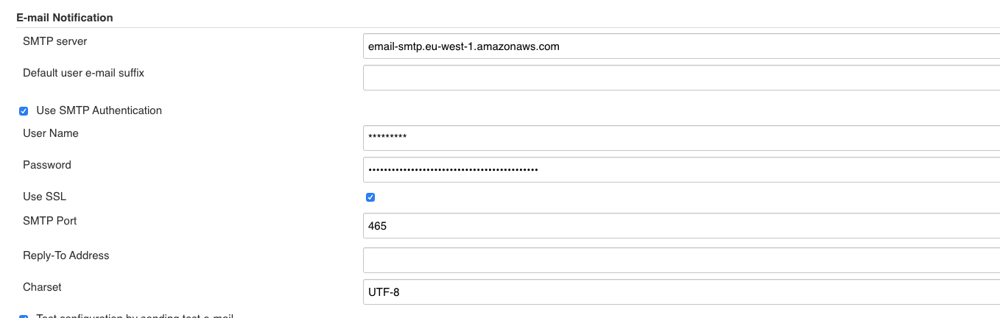

# email

Allows sending an email with a predefined body, message to the user who triggered the last build.

Everything can be modified, and one can even add recipients to the list

## Pre-requisites

The email extension must be configured in your master, with valid credentials for a SMTP server



## Default parameters

### body

    Hello, {{ repo.author_name }}.
   
    An error has happened building {{ repo.slug }}@{{ repo.branch }}: {{ env.BUILD_URL }}        
### title

    An error has happened building {{ repo.slug }}@{{ repo.branch }}


## Optional parameters

* body
* title
* additional_recipient_list

## Example

```yml
  - use: email
    with_params:
      body: |
        Hello, {{ repo.author_name }}.

        An error has happened building {{ repo.slug }}@{{ repo.branch }}
      title: |
        An error has happened building {{ repo.slug }}@{{ repo.branch }}
      additional_recipient_list:
        - your_team.group@bbva.com

```
